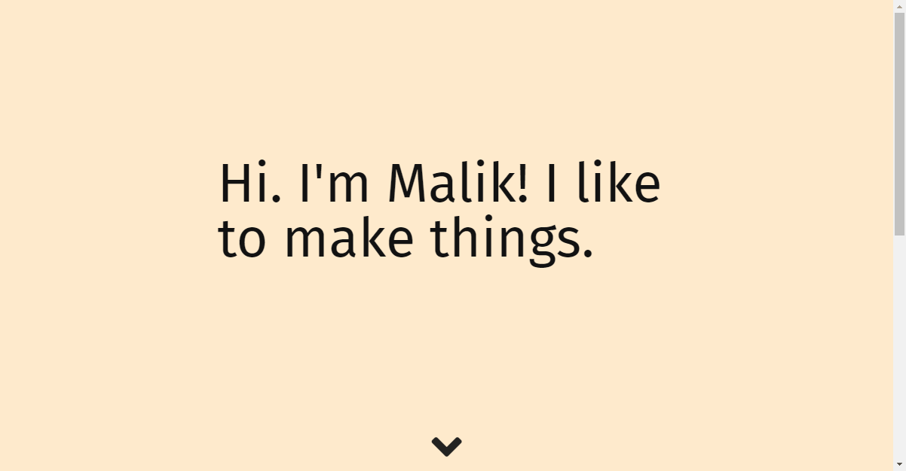

# Futureproof Website

Simple portfolio website made for a takehome exam. Being used as the base for my
own personal portfolio eventually.

Was made using exclusively CSS and HTML as part of the challenge and includes a
sliding carousel and multiple choice answer and question boxes.

Just run index.html!!

